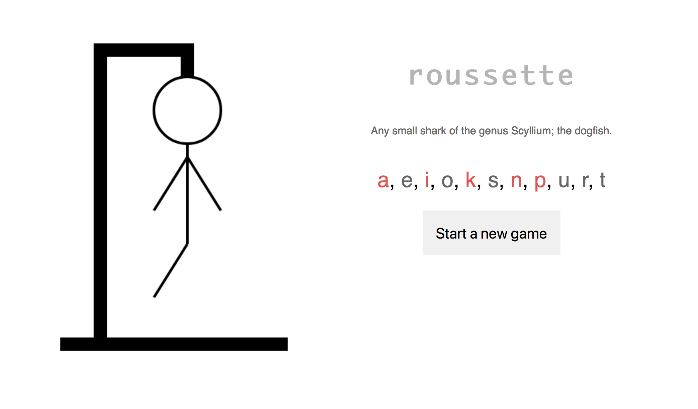

# Hangman API




**Try out the API**! Get started by creating a new game:

```
curl -X POST https://hangman-api.herokuapp.com/hangman

```

### Create new hangman game

#### Request

```
POST /hangman
```

#### Response

```
{ hangman: hangman_string, token: game token }
```

### Guess a letter

#### Request

```
PUT /hangman { token: game token, letter: guess }
```

#### Response

```
{ hangman: hangman_string, token: game token, correct: true|false }
```

When the letter has already been used

```
status 304
```

### Get solution

#### Request

```
GET /hangman { token: game token }
```
#### Response
```
{ solution: game solution, token: game token }
```
### Get hint

#### Request

```
GET /hangman/hint { token: game token }
```

#### Response

```
{ hint: letter, token: game token }
```

